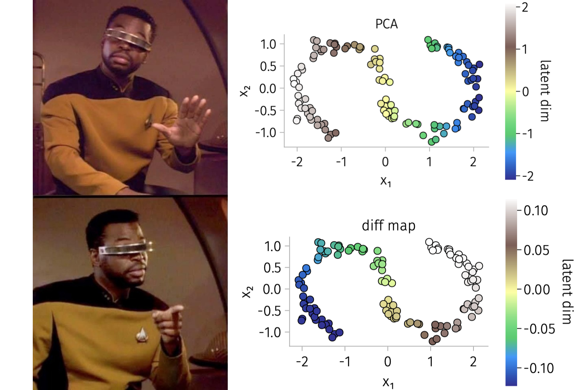

# diffusion maps

diffusion maps for non-linear dimensionality reduction / manifold learning.

### references

Coifman RR, Lafon S. Diffusion maps. _Applied and computational harmonic analysis_. 2006

J. de la Porte, B. M. Herbst, W. Hereman, S. J. van der Wal. An Introduction to Diffusion Maps. _Proceedings of the 19th symposium of the pattern recognition association of South Africa_. 2008

Tianlin Liu. A detailed derivation of the diffusion map. [link](http://tianlinliu.com/blog/2021/05/29/difussion-maps.html)
